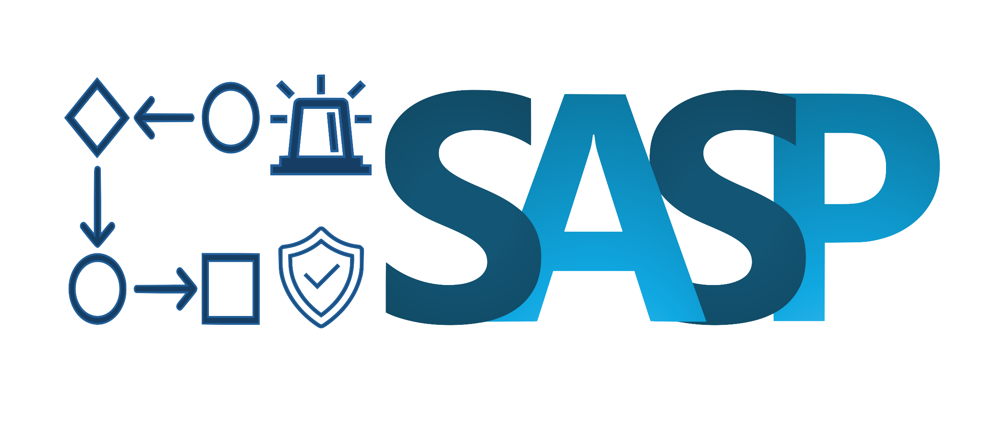

# SASP

<div id="top"></div>
<!-- PROJECT LOGO -->
<br />
<div align="center">
    
  <h3 align="center">SASP Playbook Management Tool</h3>
</div>

<!-- ABOUT THE PROJECT -->
## About The Project
This README document is designed to help the viewer understand the structure of the overall repository. The tool contains files related to the playbook management tool used to input/edit/query the mediawiki with new information. The `readme-images` folder simply contains any image files that are used in the many readme files of the project. 
The playbook management tool is designed to provide a wide variety of functionalities around cyber security playbooks. Such as playbook creation, management, limited automatic execution and easy sharing. However, the open-source version does not contain all the functionalities.

## Dependencies
As a scientific library in the Python ecosystem, we rely on external libraries to offer our features. In the `/third_party` folder, we list all the licenses of our direct dependencies. Please check the `/third_party/licenses.json` file to get a full list of dependencies and the corresponding licenses.

### Basic Technologies
- You need to download and install Semantic Mediawiki (SMW) instance. For that, you need to have [Docker](https://www.docker.com/), and then install the [SMW](https://github.com/WolfgangFahl/pymediawikidocker?tab=readme-ov-file/).
- [Python](https://www.python.org/), v3.10.13 was used for the development. Anything later *should* work fine too. Previous versions may work but are not tested. Python 2 is not supported.
### Python Packages
All the required packages are listed in the `requirements.txt` file. They can be installed using the following command:
```bash
python -m pip install -r requirements.txt
```

## Installation
Make sure all requirements listed in `requirements.txt` are available in your environment.
### Semantic Media Wiki
This section concerns the creation of a Semantic Media Wiki instance which is a prerequisite for SASP. If you are updating from a previous version or connecting to an existing instance, you can skip this section.

You can use the provided script in `mediawiki/pymediawikidocker/build.py` to automatically download and setup a dockerized Mediawiki instance.

Otherwise you need to download and install a SMW instance. For that, you need to have [Docker](https://www.docker.com/), and then install the [SMW](https://github.com/WolfgangFahl/pymediawikidocker?tab=readme-ov-file/).

### Install SASP
In order for SASP to work, the mediawiki setup must have been fully completed and the Mediawiki must be active. After the setup procedure is done, make sure the docker containers are running and then proceed with the installation of the tool. The tool is being developed using Python 3.10.13 and Django 5.1 and should be compatible with Python 3.10 and above. The tool is currently being developed on Windows 10, but should be compatible with Linux and MacOS as well.

### Configuration
You'll find the projects configuration files under `SASP/config`.

The project uses a `config.ini` and `keys.ini` to store configuration and sensitive information. 
In the `SASP/config/` folder, there is a `config_example.ini` and `keys_example.ini` file that can be used as a template for the actual `config.ini` and `keys.ini` files. Below is an overview of the variables used in the project and installation.

#### Overview of Configuration Variables
##### Config.ini
| Section | Variable | Description | Optional | Notes |
| --- | --- | --- | --- | --- |
| __Wiki__ | `url` | The base url of the connected Mediawiki instance | No | - |
| __Wiki__ | `api_path` | Path to the mediawiki api | No | - |
| __Wiki__ | `user_path` | Path to the mediawiki user pages | No | - |
| __Wiki__ | `bot_user` | Username of the mediawiki system user | No | - |
| __MISP__ | `url` | URL to the MISP instance | Yes | Used for sharing playbooks via MISP, not essential for the tool to work if not used |
| __Keycloak__ | `url` | URL to the Keycloak instance for SSO | No | - |
| __Keycloak__ | `client` | Client ID for the Keycloak instance | No | - |
| __Keycloak__ | `realm` | Realm for the Keycloak instance | No | - |
| __Kafka__ | `client` | Client ID for the Kafka instance | Yes | Used for sharing playbooks via Kafka, not essential for the tool to work if not used |
| __Kafka__ | `bootstrap_server` | URL to the Kafka instance | Yes | Used for sharing playbooks via Kafka, not essential for the tool to work if not used |
| __Kafka__ | `registry_url` | URL to the Kafka registry instance | Yes | Used for sharing playbooks via Kafka, not essential for the tool to work if not used |
| __Kafka__ | `consumer` | Consumer group ID for the Kafka instance | Yes | Used for sharing playbooks via Kafka, not essential for the tool to work if not used |
| __Kafka__ | `ssl_ca` | Path to the Kafka CA certificate | Yes | Used for sharing playbooks via Kafka, not essential for the tool to work if not used |
| __Kafka__ | `ssl_certificate` | Path to the Kafka client certificate | Yes | Used for sharing playbooks via Kafka, not essential for the tool to work if not used |
| __Kafka__ | `ssl_key` | Path to the Kafka client key | Yes | Used for sharing playbooks via Kafka, not essential for the tool to work if not used |
| __Kafka__ | `ssl_registry_key` | Path to the decrypted Kafka client key | Yes | Used for sharing playbooks via Kafka, not essential for the tool to work if not used |
| __SASP__ | `app_application_id` | An identifier for this application | No | - |

  ##### Keys.ini
| Section | Variable | Description | Optional | Notes |
| --- | --- | --- | --- | --- |
| __Wiki__ | `bot_password` | Password of the mediawiki bot user | No | - |
| __MISP__ | `key` | API key for the MISP instance | Yes | - |
| __Kafka__ | `ssl_key_pwd` | Password for the Kafka client key | No | - |
| __Keycloak__ | `client_secret` | Secret token for connected Keycloak instance | No | - |

### Automatic Setup
1.  Install all the prerequisites from the previous chapter
2.  Make sure the mediawiki is running and the connection information is correct in the config files.
3.  Execute the following commands
```sh
cd SASP
python setup.py
```

### Manual Setup
1. Install all the prerequisites from the previous chapter
2. Make sure the mediawiki is running and the connection information is correct in the config files.
3. Execute the following commands
```sh
cd SASP
# Creates the database
python manage.py migrate
# Creates the default user with the configuration information from the `*.ini` files
python manage.py make_default_user
# Compiles the forms and pushes them to the wiki
python manage.py update_forms
```

## Updating the Tool
Unless otherwise instructed you only need to update the database and the default user, so use the provided switches in the `setup.py` script to skip the form update and playbook import steps.

## Running the Program
Assuming everything is set up correctly, you can run the program with the following steps:
1. Run SASP from the terminal while in the project's folder
   ```sh
    python manage.py runserver
    ```  
    You can also specify address and port to run the server on. For example:
    ```sh
    python manage.py runserver 0.0.0.0:8000
    ```
2. Open the browser and navigate to the URL that is printed in the terminal. By default this is `http://localhost:8000/sasp/`

### Additional Commands
There are a few additional commands that can be used to interact with the tool all are invoked with `python manage.py <command>`. 
- `import_playbook`: Imports a playbook from a json file into the tool
  - `--path`: Path to the json file (Required)
- `make_default_user`: Creates a default user with the configuration information from the `*.ini` files or overwrites the existing one
- `createsuperuser`: Django command to create a superuser. With this user you can access the admin interface of the tool at `http://localhost:8000/admin/` and manage the database

<!-- FILES OVERVIEW -->
### Package Overview
The tool code is located in the `sasp` folder.
To give an overview of each file/folder:
- `auth`: Contains methods for SSO using Keycloak
- `localization`: Contains localization files
- `management`: Contains definitions of Django management commands
- `migrations`: Contains Django migrations. Djangos migration system is used to keep the database in sync with the models
- `misp_sharing_tool`: Contains the original and modified versions of the MISP sharing tool that was used as a base for the SASP's MISP sharing functionality
- `models`: Contains the Django models, that represent the database tables
- `sasp_exceptions`: Contains custom exceptions for the tool
- `sharing_kafka`: Contains current efforts to implement sharing via Kafka
- `static`: Contains static files like CSS, JS and images
- `templates`: Contains the HTML templates for the tool
- `templatetags`: Contains custom template tags for use in Django's templating system
- `util`: Contains utility functions
- `views`: Contains the views, that provide the bulk of the interfaces and logic
- `wiki_forms`: Contains the forms that define the playbooks on the wiki
- `admin.py`: Django admin interface configuration
- `apps.py`: Django app configuration
- `bpmn_util.py`: functions related to generating BPMN diagrams
- `db_syncs.py`: functions for syncing the tool database with the mediawiki
- `file_export_util.py`: functions for exporting playbooks to json
- `file_import_util.py`: functions for importing playbooks from json
- `forms.py`: Django forms, that provide user input for the tool
- `knowledge.py`: Location for information like paths or formats that is available to the entire project
- `logic_management.py`: functions too complex to be in the views
- `MISPInterface.py`: functions for interacting with the MISP instance
- `sanitizer_util.py`: functions for sanitizing playbooks before exporting
- `serializers.py`: Django serializers, that provide a way to convert complex data types to and from native Python data types. Mostly used for the REST API
- `tests.py`: Django tests
- `urls.py`: Django URLs, that map URLs to views
- `utils.py`: utility functions
- `vocabulary_translator.py`: contains a variety of functions and data structures for translating between the tool, the mediawiki and the CACAO standard
- `wiki_forms.py`: functions for interacting with the forms that define the playbooks on the wiki
- `wiki_interface.py`: functions for interacting with the mediawiki

### Frontend
The UI was designed using Django. There are a variety of tutorials online that can help you get started with Django. The [official documentation](https://docs.djangoproject.com/en/5.0/) is also a good resource.

### Release Notes

To track the incremental updates, please refer to the [CHANGELOG](./CHANGELOG) file.

## Technologies Used
This section should list all the major technologies that are used to develop the project within the repository.

* [pymediawikidocker](https://github.com/WolfgangFahl/pymediawikidocker)
* [Docker](https://www.docker.com/)
* [PHP](https://www.php.net/)
* [Python](https://python.org/)
* [Django](https://www.djangoproject.com/)
* [Keycloak](https://www.keycloak.org/)
* [Bootstrap](https://getbootstrap.com/)
* [CACAO](https://docs.oasis-open.org/cacao/security-playbooks/v1.1/security-playbooks-v1.1.html)

## Citation
This project has received funding from the European Union’s Horizon 2020 research and innovation programme under grant agreements No 833418 ([SAPPAN](https://sappan-project.eu/)) and No 101020560 ([CyberSEAS](https://cyberseas.eu/)).
To reference our work in your publications, please use the following papers:

**Playbook management tool:** 
Mehdi Akbari Gurabi, Avikarsha Mandal, Jan Popanda, Robert Rapp, and Stefan Decker. "SASP: a Semantic web-based Approach for management of Sharable cybersecurity Playbooks." In Proceedings of the 17th International Conference on Availability, Reliability and Security, pp. 1-8. 2022.
[DOI](https://doi.org/10.1145/3538969.3544478)

**Integration with security tools, automation and reporting effort:**
Mehdi Akbari Gurabi, Lasse Nitz, Andrej Bregar, Jan Popanda, Christian Siemers, Roman Matzutt, and Avikarsha Mandal. "Requirements for Playbook-Assisted Cyber Incident Response, Reporting and Automation." Digital Threats: Research and Practice (2024).
[DOI](https://doi.org/10.1145/3688810)

<p align="center">
  
</p>

